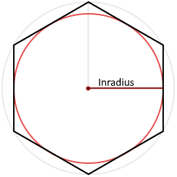
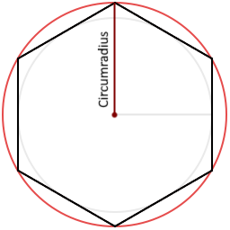

# Borealis

Developed with Unreal Engine 5


# 1. Chapter 1 - Creating a Hexagonal Grid
Many games use hexagonal grids, especially strategy and board games, Including Age of Wonders, Civilization, Endless
Legends, Then Settlers of Catan, and Twilight Imperium. Hexagonal grids are popular in strategy games as they allow
more natural movement without the diagonal distortion of a square grid. Since most strategy games use pointy topped
hexagons, I will be following their example and use pointy topped hexagons as well.

## 1.1 Turn Squares into Hexagons
Before we get started we have to settle on a size for the hexagons. Let's pick a circumradius of 50 units. Because a
hexagon consists of a circle of six equilateral triangles, the distance from the center to any corner is also 50. This
makes the hexagon have a size of around 100 units or 1m².




Now that we know the circumradius (a), we can calculate the inradius (r) using the following formula.
```r = a · √3 / 2```

This is what the formula looks like when written out in code.
```c++
float r = a * FMath::Sqrt(3.0f) / 2.0f;
```

But there might be an easier the having to recalculate
the result everything using the expensive square root. Since ``√3 / 2`` always gives the same result, we can precalculate
its value. The result is about 0.886.
Let's put it in a struct so that we can use this at a later moment.
```c++
USTRUCT()
struct FHexMetrics
{
	GENERATED_BODY()

	float Circumradius = 50.f;
	float Inradius = Circumradius * 0.866025404f;
};
```

Let's also define the positions of the six corners relative to the cell's center. I started with the top corner and add
the rest in clockwise order, placing them in the XY plane, so that the hexagons wil be aligned with the ground.

```c++
TArray<FVector> Corners = {
    {0.f, Circumradius, 0.f},
    {-Inradius, 0.5f * Circumradius, 0.5},
    {-Inradius, -0.5f * Circumradius, 0.f},
    {0.f, -Circumradius, 0.f},
    {Inradius, -0.5f * Circumradius, 0.f},
    {Inradius, 0.5f * Circumradius, 0.f},
};
```
